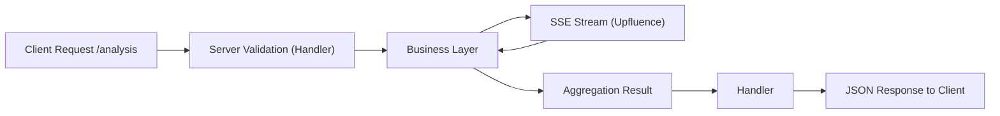
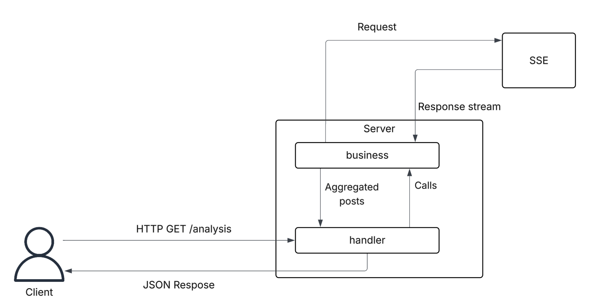

# Upfluence Coding Challenge – SSE Aggregator API

## Overview

This project implements a simple HTTP API server that aggregates social media posts from Upfluence's SSE (Server-Sent Events) stream. The API computes summary statistics over a user-defined time window and dimension (likes, comments, favorites, retweets).

The server is written in Go with a minimal React + Vite + TypeScript frontend for quick demos. The code is modular with clear separation between **handlers**, **business logic**, **models**, and **helpers**.

## Architecture

### Flow Diagram



### Architecture Overview


_Diagramme d'architecture du système SSE Aggregator_

### Process Flow

1. **Client Request**: Client sends `GET /analysis?duration=...&dimension=...`
2. **Server Validation**: Server validates inputs and calls the business layer
3. **Data Fetching**: Business layer fetches posts from the SSE stream for the specified duration
4. **Aggregation**: Business layer parses and aggregates posts (total, min/max timestamp, avg\_<dimension>)
5. **Response**: Server returns structured JSON result

## API Endpoint

### `GET /analysis`

Analyzes social media posts from the SSE stream over a specified time window.

#### Query Parameters

| Parameter   | Type   | Description                 | Example                                      |
| ----------- | ------ | --------------------------- | -------------------------------------------- |
| `duration`  | string | Time window for aggregation | `5s`, `10m`, `1h`                            |
| `dimension` | string | Metric to analyze           | `likes`, `comments`, `favorites`, `retweets` |

#### Example Request

```bash
curl "http://localhost:8080/analysis?duration=30s&dimension=likes"
```

#### Example Response

```json
{
  "total_posts": 20,
  "minimum_timestamp": 1660937556,
  "maximum_timestamp": 1758819120,
  "avg_likes": 50
}
```

## Project Structure

```
upfluence-coding-challenge/
├── client/                     # React + Vite frontend
│   ├── src/
│   │   ├── components/         # React components
│   │   ├── types/             # TypeScript type definitions
│   │   └── ...
│   └── package.json
├── server/                     # Go backend
│   ├── main.go                # Application entry point
│   ├── handlers/              # HTTP request handlers
│   ├── business/              # SSE reading + aggregation logic
│   ├── models/                # Data models (Post, AnalysisResult)
│   ├── helpers/               # Utility functions
│   ├── constants/             # Application constants
│   ├── router/                # HTTP routing
│   └── tests/                 # Unit tests
├── Makefile                   # Build and run commands
└── README.md
```

## Tech Stack

### Backend

- **Language**: Go 1.21+ — Fast, compiled, excellent concurrency support
- **HTTP Server**: Standard `net/http` — No external dependencies
- **Testing**: `go test` with dependency injection for deterministic tests

### Frontend

- **Framework**: React 18+ with TypeScript 5.0+ — Strong typing and reusable components
- **Build Tool**: Vite 5.0+ — Fast development and optimized builds
- **Styling**: CSS3 with modern features

### Development

- **SSE Parsing**: Sequential read for clarity and simplicity
- **Testing**: Mocked dependencies for reliable, fast tests
- **CORS**: Configured for development environment

## Getting Started

### Prerequisites

- Go 1.21 or higher
- Node.js 18+ and npm
- Make (optional, for convenience commands)

### Backend Setup

1. **Navigate to server directory**:

   ```bash
   cd server
   ```

2. **Run the server**:

   ```bash
   go run main.go
   ```

   **OR** use the Makefile:

   ```bash
   make server
   ```

3. **Verify server is running**:
   You should see `Server listens on: http://localhost:8080` in your terminal.

### Frontend Setup

1. **Navigate to client directory**:

   ```bash
   cd client
   ```

2. **Install dependencies**:

   ```bash
   npm install
   ```

3. **Start development server**:

   ```bash
   npm run dev
   ```

   **OR** use the Makefile from root:

   ```bash
   make install && make dev
   ```

4. **Access the application**:
   - Frontend: http://localhost:5173
   - Backend API: http://localhost:8080

### Running Tests

```bash
cd server
go test ./...
```

> **Note**: Tests use mocked SSE fetchers for deterministic results without external network calls.

## Frontend Features

The frontend is a minimal Vite + React + TypeScript application that provides:

- **Duration Selection**: Pick numeric duration with unit (s/m/h)
- **Dimension Selection**: Choose metric to analyze (likes/comments/favorites/retweets)
- **Real-time Analysis**: Calls backend `/analysis` endpoint and displays results
- **Error Handling**: User-friendly error messages and loading states

### CORS Configuration

The backend allows requests from `http://localhost:5173` during development. If you change the frontend port or deploy, update the server's CORS configuration accordingly.

## Error Handling & Logging

- **Structured Errors**: All errors return JSON format: `{"error": "...", "message": "..."}`
- **Request Logging**: Handler logs incoming duration/dimension and post counts
- **Missing Metrics**: Posts without specific metrics default to 0
- **Graceful Degradation**: System handles missing or malformed data gracefully

## Trade-offs & Assumptions

- **SSE Parsing**: Line-by-line parsing with multi-line event concatenation
- **Missing Data**: Posts without metrics default to 0
- **Dynamic Fields**: JSON response includes `avg_<dimension>` field names
- **Design Priority**: Clarity and testability over premature optimization

## Future Improvements

- [ ] **Reliability**: Make the SSE client more robust, e.g., automatically reconnect if the stream fails.
- [ ] **Deployment**: Docker containers and docker-compose setup
- [ ] **Documentation**: OpenAPI/Swagger specification

---

**Built with Go, React, and TypeScript**
